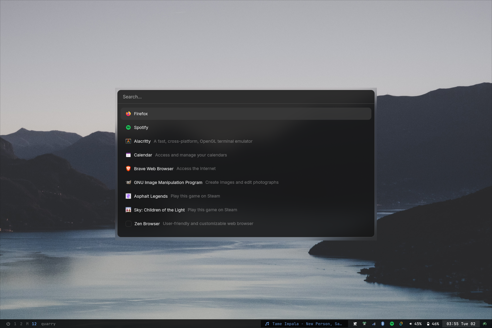
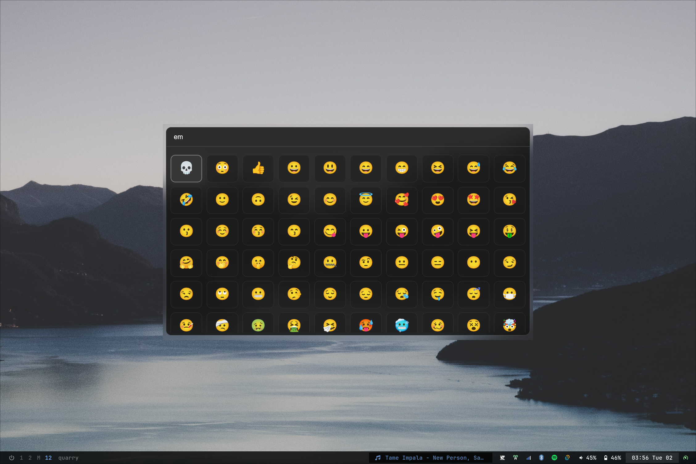
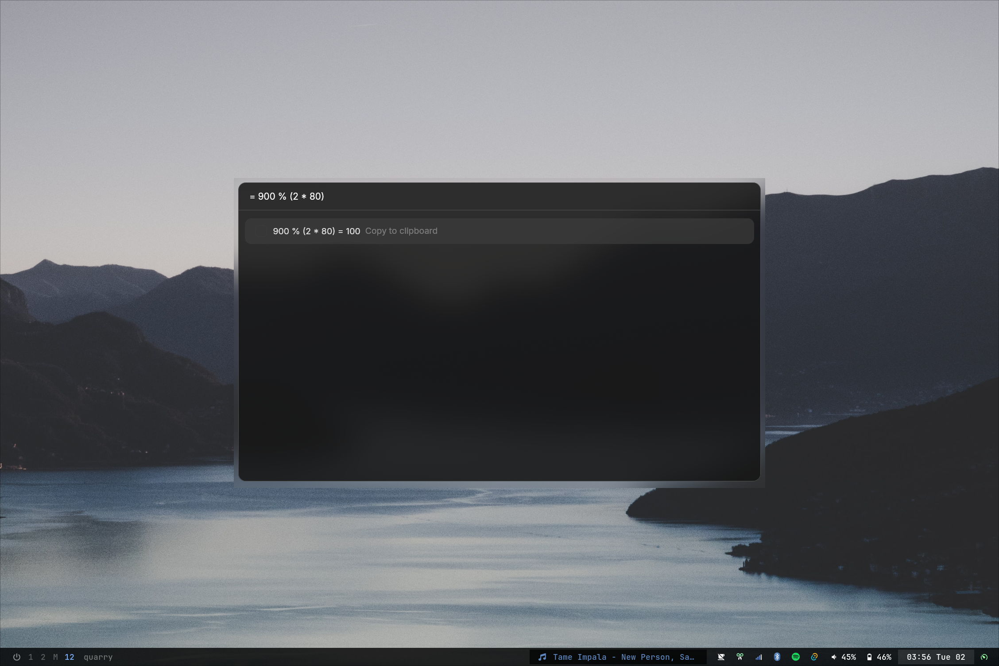
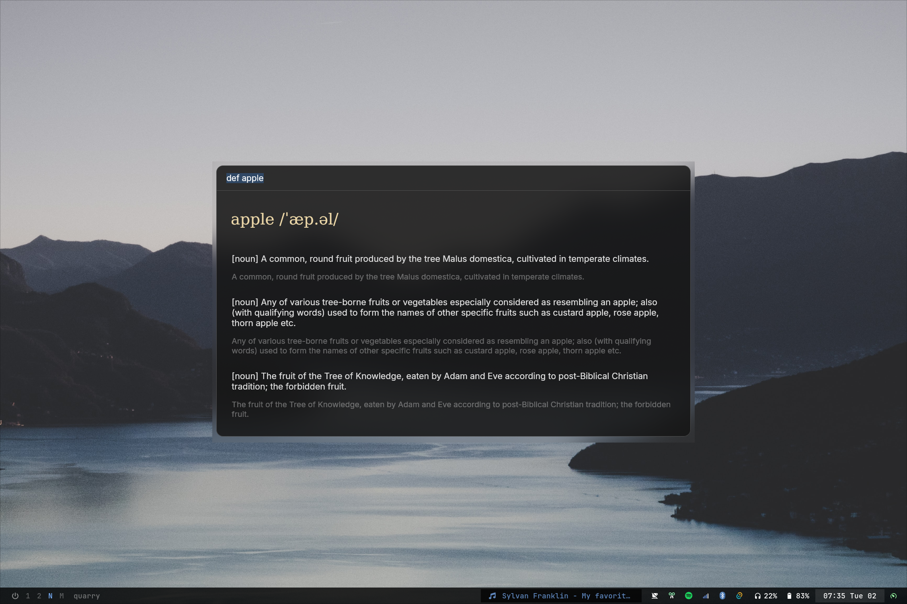
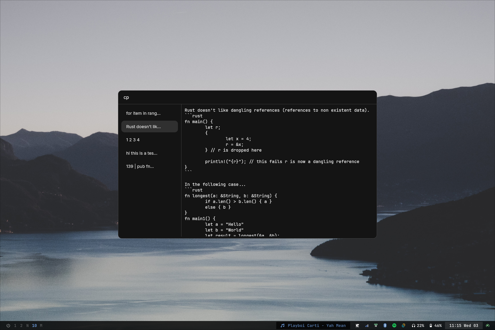

# Quarry

- Globalized app/shortcut launcher, written in Tauri/Svelte
- Currently developed focused on a Hyprland/NixOS setup but _should_ work everywhere 
- Currently aiming to fix _my_ gripes with already existing app launchers
- Lots of inspiration taken from [raycast](https://www.raycast.com/) 
- This is my first big project, so development might be slow. If you're smart I'd appreciate any feedback 😁

```
$ pnpm install
$ pnpm run tauri dev
```

# Current capabilities

- App search (prefix `app` or type normally)


- Emoji search  (prefix `em`)


- Math (prefix `=` or type normally)


- Web search (prefix `http`, `g`, `yt`, `nxp`, `gh`)


- Dictionary (prefix `def`)


- Clipboard (prefix `cp`, to clear run `cp !clear`)


- Color Picker (`color`)


# Todo 

- [ ] prefix settings separate from lib.rs 
- [ ] figure out extendability somehow


"PLUGINS"
- [x] web searches BUILTIN
- [x] math BUILTIN
- [ ] currency conversion
- [ ] color preview/picker
- [x] emoji picker BUILTIN
- [ ] world/clock/timer management  
- [x] lorem generator
- [ ] notes integration  BUILTIN
- [ ] translation 
- [x] clipboard history BUILTIN
- [ ] basic chatgpt/gemini integration(?) 
- [ ] spotify controls (or general media playback contorls)
