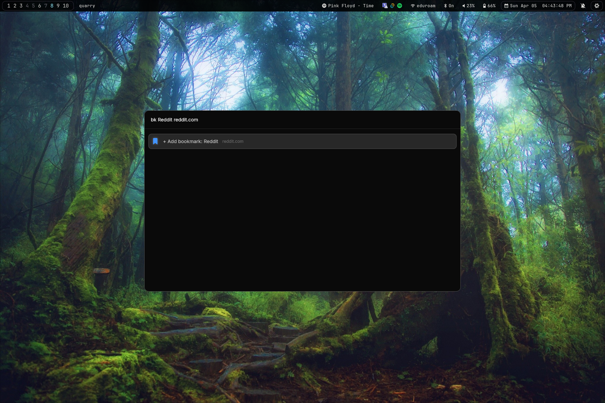
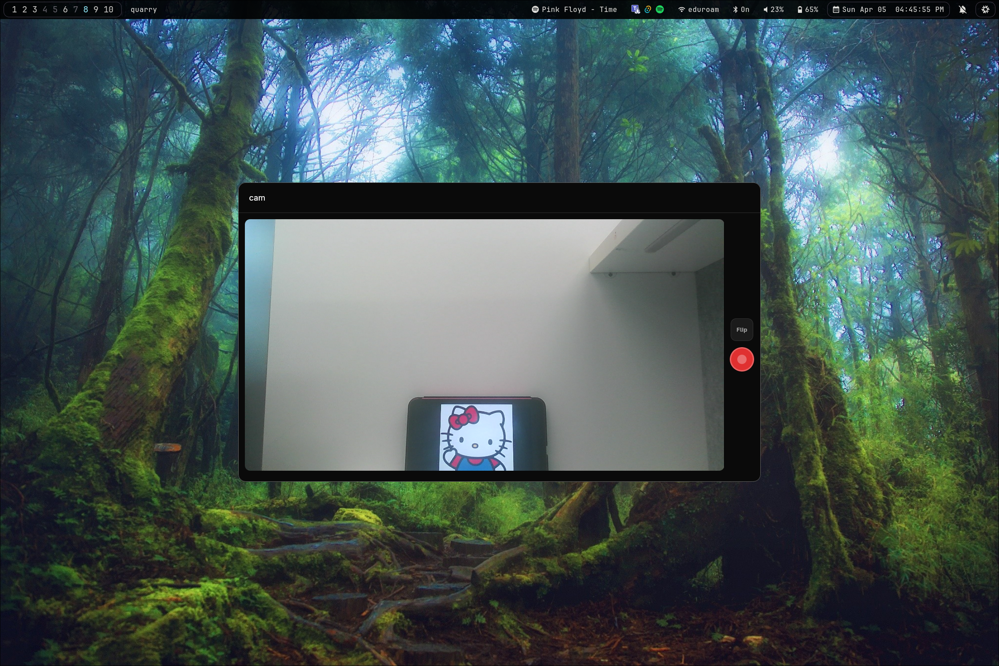
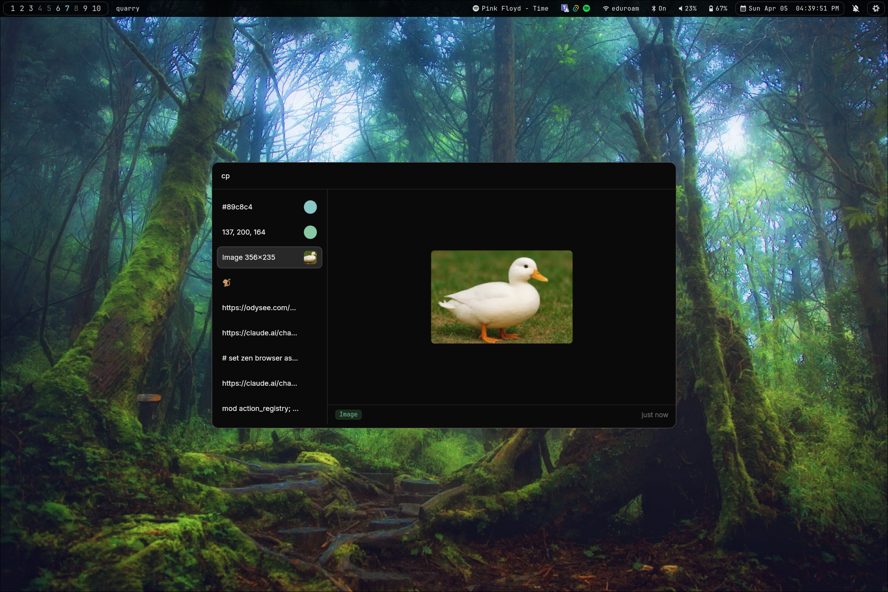
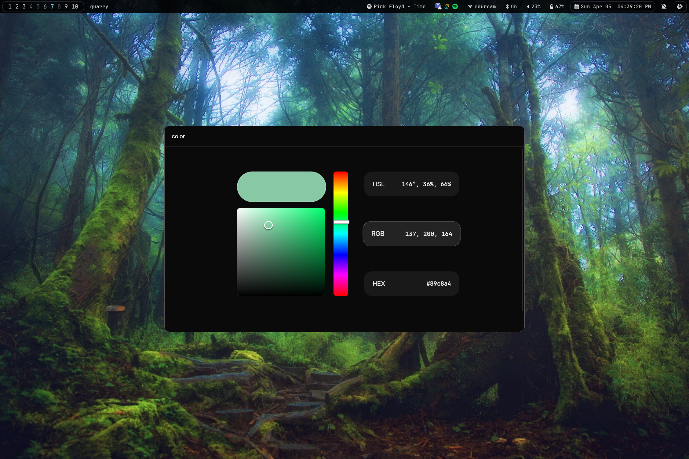
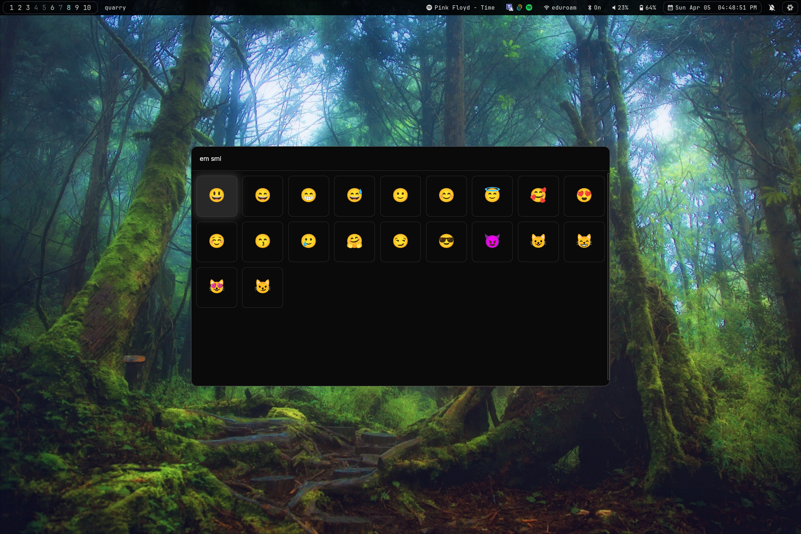
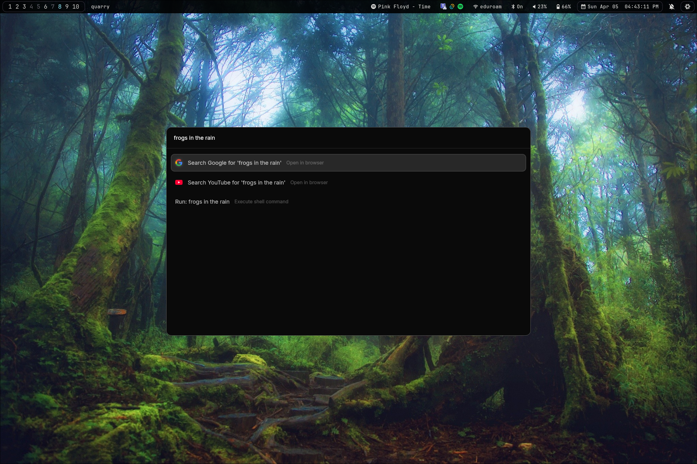

# Quarry

- Globalized app/shortcut launcher
- Currently developed focused on a Hyprland / NixOS setup, but it _should_ work on most distributions (not tested)
- Currently aiming to fix _my_ gripes with already existing app launchers
- Lots of inspiration taken from [Raycast](https://www.raycast.com/) 
- This is my first big project, so development might be slow. If you're smart I'd appreciate any feedback 😁

> Rust/Svelte

## Setup

Clone the repo and `cd` to it

```
$ nix-shell 
$ pnpm install
$ pnpm run tauri dev
```

- This should start a process and put an icon in your system tray
- To toggle visibility
    - Either use the tray icon menu
    - Or run the `quarry-toggle` binary in `src-tauri/target/debug/quarry-toggle`, I have this mapped to `Alt-Space`

# Capabilities
- Search apps, emojis, files 
- Colorpicker
- Clipboard manager (text + images)
- Calculator
- Camera preview
- Custom bookmarks implementation
- Web search
- Dictionary


<div align="center">
  
  
  
</div>

<div align="center">
  
  
  
</div>

<div align="center">
  
  
  
</div>

# Configuration

- Edit the `.config/quarry/config.toml` file 

```toml
[theme]
background_color    = "rgba(10, 10, 10, 1)"
background_opacity  = 1.0
font_size           = 14
font_color          = "rgba(255, 255, 255, 1)"
border_radius       = 14
border_color        = "rgba(255,255,255,0.35)"
border_thickness    = 1
item_border_radius  = 12
active_bg_color     = "rgba(40, 40, 40, 1)"
active_border_color = "rgba(255,255,255,0.1)"

[triggers]
# Each value is a full regex. The first capture group is passed as the
# query to the searcher. No capture group = empty string passed.
# Invalid regex: that trigger is skipped with a warning at startup.
camera       = '^cam$'
bookmarks    = '^bk\s+(.*)$'
files        = '^f\s+(.*)$'
clipboard    = '^cp\s+(.*)$'
emojis       = '^em\s+(.*)$'
google       = '^g\s+(.*)$'
youtube      = '^yt\s+(.*)$'
nix          = '^nxp\s+(.*)$'
github       = '^gh\s+(.*)$'
shell        = '^!\s+(.*)$'
lorem        = '^lorem\s+(.*)$'
math         = '^=\s*(.*)$'
dictionary   = '^def\s+(.*)$'
system       = '^sys\s+(.*)$'
color_picker = '^color$'
apps         = '^app\s+(.*)$'
url          = '^(https?://\S+|(?:[a-zA-Z0-9](?:[a-zA-Z0-9\-]*[a-zA-Z0-9])?\.)+[a-zA-Z]{2,}(?:[:/]\S*)?)$'
```

