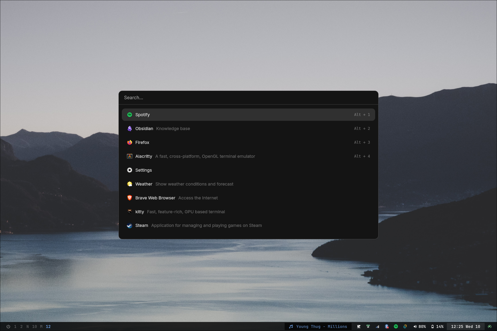
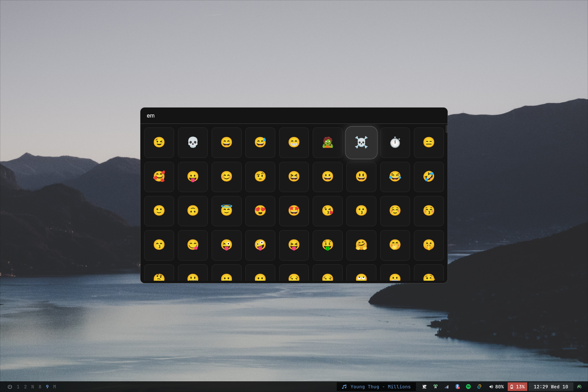
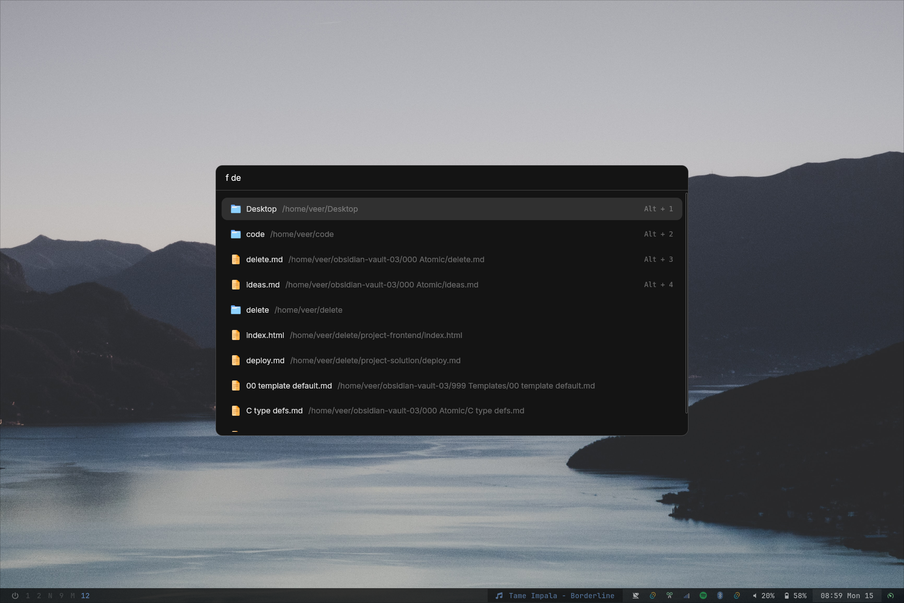
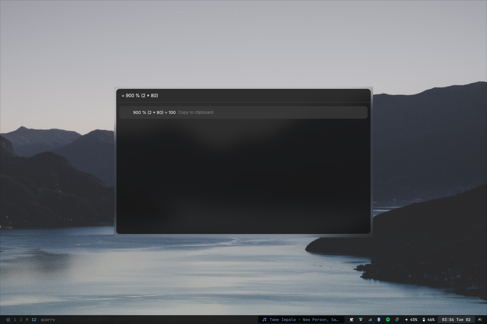
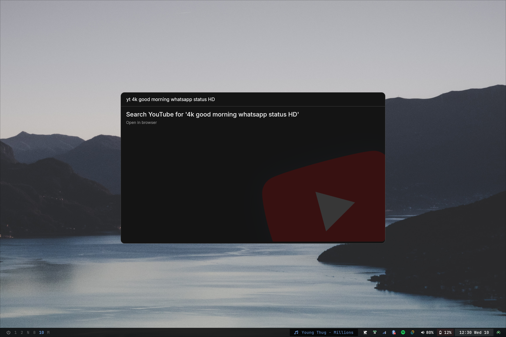
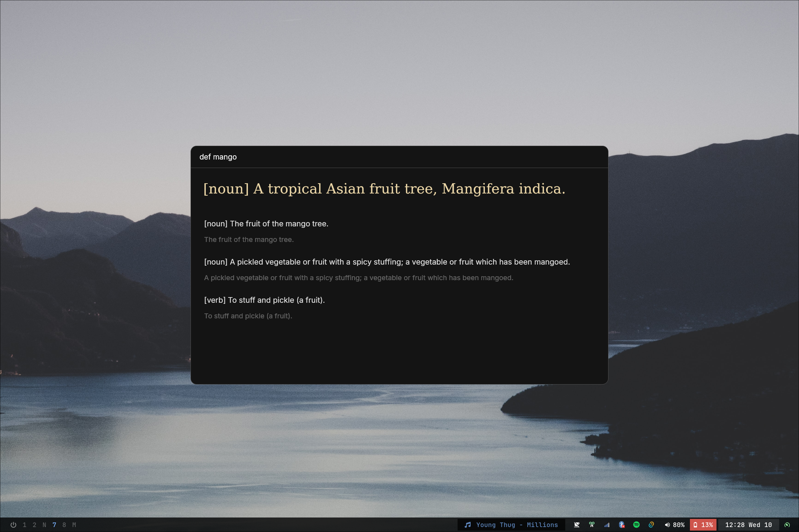
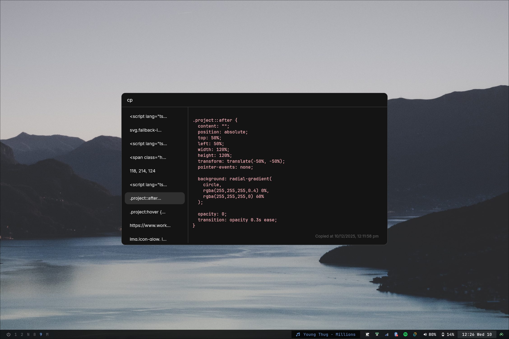
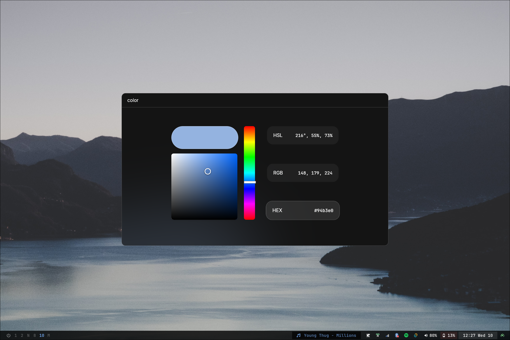

# Quarry

- Globalized app/shortcut launcher
- Currently developed focused on a Hyprland / NixOS setup, but it _should_ work on most distributions (not tested)
- Currently aiming to fix _my_ gripes with already existing app launchers
- Lots of inspiration taken from [Raycast](https://www.raycast.com/) 
- This is my first big project, so development might be slow. If you're smart I'd appreciate any feedback 😁

> Rust/Svelte

## Setup

Clone the repo and `cd` to it

```
$ nix-shell 
$ pnpm install
$ pnpm run tauri dev
```

- This should start a process and put an icon in your system tray
- To toggle visibility
    - Either use the tray icon menu
    - Or run the `quarry-toggle` binary in `src-tauri/target/debug/quarry-toggle`, I have this mapped to `Alt-Space`

```
# hyprland.conf
bind = ALT, SPACE, exec, /home/veer/code/personal/quarry/src-tauri/target/debug/quarry-toggle
windowrulev2 = pin, class:^(quarry)$
windowrule = noborder, class:^(quarry)$
windowrulev2 = animation gnomed, class:^(quarry)$
# windowrulev2 = noanim, class:^(quarry)$
windowrulev2 =  noblur,class:^(quarry)$
```

# Current capabilities

- App search (prefix `app` or type normally)


- Emoji search  (prefix `em`)


- File search (prefix `f`)


- Math (prefix `=` or type normally)


- Web search (prefix `http`, `g`, `yt`, `nxp`, `gh`)


- Dictionary (prefix `def`)


- Clipboard (prefix `cp`, to clear run `cp !clear`)


- Color Picker (`color`)

